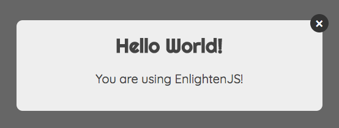
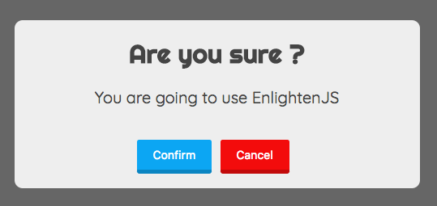
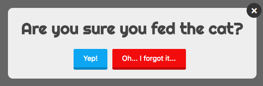
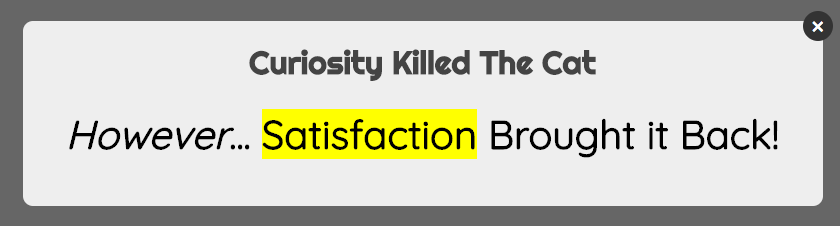
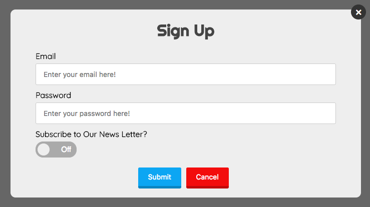
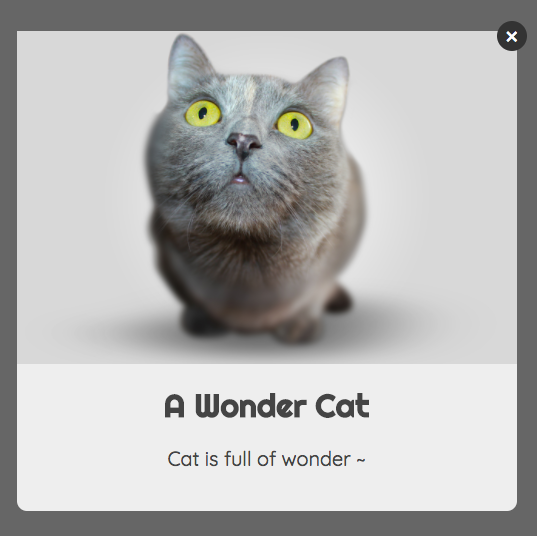
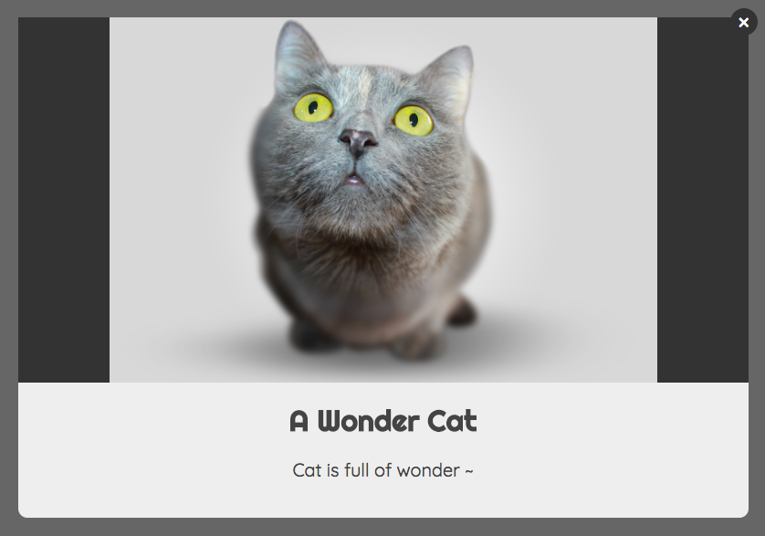
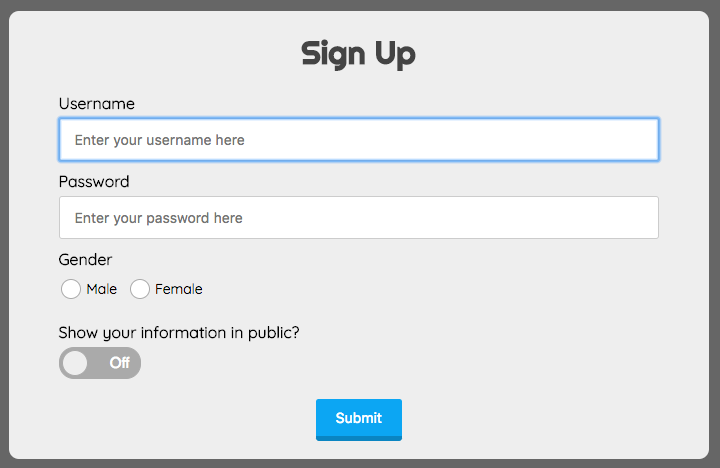
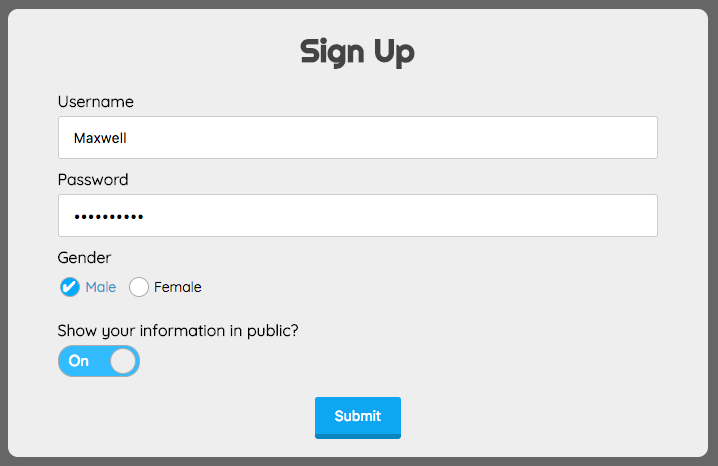
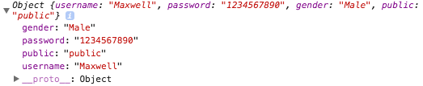

# EnlightenJS
## Simple HTML Lightbox Parser

EnlightenJS is built by Maxwell Alexius, it is a simple JavaScript plugin that can render out HTML pop out lightbox with just a few lines of code.

## <span id="manual">Manual</span>
- [Getting Started](#getting-started)
- [Enlighten Box Structure](#enlighten-box-structure)
- [Enlighten Features](#enlighten-features)
- [Enlighten Image](#enlighten-image)
- [Enlighten Form](#enlighten-form)
- [Enlighten Styling](#enlighten-styling)

## <span id="getting-started">Getting Started</span>

You can clone this repository and include the JS and CSS file in your HTML document :

```html
<script src="enlighten.js"></script>
<link rel="stylesheet" href="enlighten.css">
```

You can try to add simple code using Enlighten object :

```html
<script>
  Enlighten({
    title: 'Hello World!',
    content: 'You are using EnlightenJS!'
  });
</script>
```



Simple but it can be more useful when it occurs to a confirm box combine with returned `Promise` object :

```js
Enlighten({
  title: 'Are you sure ?',
  content: 'You are going to use EnlightenJS',
  confirmBtn: true,
  cancelBtn: true,
  closeBtn: false,
  allowOutsideClick: false
}).then(function() {
  /* When user clicked confirm button */
  Enlighten({
    title: 'Congratulation!'
  });
}).catch(function() {
  /* When user clicked cancel button */
  Enlighten({
    title: 'Try it again ~ Please ~'
  });
});
```



Check out the [manual](#manual) to see other features which is provided by EnlightenJS!

## <span id="enlighten-box-structure">Enlighten Box Structure</span>

### Basic Structure
EnlightenJS provides a simple way to render out HTML lightbox, it can be mainly divided into three parts which are `header`, `body` and `footer`. (However, in the [Enlighten Image](#enlighten-image) section, the `image-wrapper` is the fourth part which is placed in the beginning of the box structure and before the `header` part.) This is the base structure of the Enlighten Box, starting with its root element :

```
  - Enlighten Root
    - Enlighten Box
      - Header
        - CloseBtn (The top-right button which can close the Enlighten box)
        - Title
      - Body
        - Content | HTML | Form
      - Footer
        - ConfirmBtn
        - CancelBtn
```

[Back To Menu](#manual)

## <span id="enlighten-features">Enlighten Features</span>

### `title` Property is Required in EnlightenJS
In order to render out the Enlighten box, it is required to input an object which at least contains `title` property. If EnlightenJS didn't know the value of the `title`, it will console out the error message and won't render out the Enlighten box.

```js
Enlighten({
  title: "Hello! EnlightenJS!"
});
```

Instead of input an object, you can also choose to input a string which, in default, is set to be as the title of the Enlighten box :

```js
Enlighten("Hello! EnlightenJS!")
```

### Confirm & Cancel Buttons
EnlightenJS provide a simple confirmation box feature, specifing either one or both of the `confirmBtn` and `cancelBtn` property to `true`, you can generate the Enlighten box with buttons inside the footer part. You can change the text on the buttons using `confirmBtnText` and `cancelBtnText`. When there exist a button, it will return a `Promise` object which can let you chain the `then` and the `catch` methods on Enlighten object.

```js
Enlighten({
  title: 'Are you sure you fed the cat?',
  confirmBtn: true,
  cancelBtn: true,
  confirmBtnText: 'Yep!',
  cancelBtnText: 'Oh... I forgot it...'
}).then(function() {
  Enlighten('Great, next you need to clean its poop!');
}).catch(function() {
  Enlighten('Oh no! The cat is starving!');
});
```



### Pop Out Animation
You can specify the animation type using the `animationType` property. You can check out [animate.css](https://daneden.github.io/animate.css/) to see the type of the animation, however, you don't need to include it. The duration of the animation can be specified by the `animationDuration` property with the number value with unit of second.

```js
Enlighten({
  title: 'EnlightenJS Provides Animation ~ !',
  content: 'Simply specify the type of the animation to the animationType property!',
  width: 800,
  animationType: 'tada',
  animationDuration: 1
});
```

### Enlighten Body Content, HTML or Form
You can add the message of the Enlighten box via the `content` property, the content will be placed in the body part of the Enlighten box structure. Default style `text-align` is `"center"` and used `"Quicksand, serif"` as default `font-family`.

```js
Enlighten({
  title: 'Curiosity Killed The Cat',
  content: 'However... Satisfaction Brought it Back!'
});
```

You can also input HTML tags as a string into `html` property provided by EnlightenJS. Input HTML string will be converted to nodes and appended as child elements to the body part of the Enlighten box.

```js
Enlighten({
  title: 'Curiosity Killed The Cat',
  width: 800,
  html: '<h1 style="text-align: center;"><i>However</i>... <mark>Satisfaction</mark> Brought it Back!</h1>'
});
```



Another awesome feature is to use the `form` property supported by EnlightenJS, it can automatically generate the HTML form from the value of the `form` property accordingly. <a href="#enlighten-form">Look for more information about Enlighten Form</a>.

**Warning! This feature is currently under construction, the image shows the prototype of the result, the feature may vary in nearly future.**

```js
Enlighten({
  title: 'Sign Up',
  confirmBtn: true,
  cancelBtn: true,
  confirmBtnText: 'Submit',
  form: {
    action: 'simple_form',
    method: 'post',
    name: 'signup-form',
    inputs: [
      {
        type: 'email',
        labelName: 'Email',
        name: 'email',
        placeholder: 'Enter your email here!'
      },
      {
        type: 'password',
        labelName: 'Password',
        name: 'password',
        placeholder: 'Enter your password here!'
      },
      {
        type: 'switch',
        labelName: 'Subscribe to Our News Letter?',
        name: 'subscribe'
      }
    ]
  }
});
```


### Precedence of the Body Part
There are three types of content can show in the Enlighten body part, which are `content`, `html` and `form`. **Default `content` have the highest priorty than `html` and `form` property**, which means when the `content` property presents, the other two properties will have no effect. The next is the `html` and the last is `form` content, which means when `html` and `form` are specified at the same time, the `form` will not generated while `html` string will be converted to elements in normal condition.

EnlightenJS will warn you in the console when you have two or all of them specified at the same time, just to mention that you can make your code simplified in Enlighten object.

### Styling Enlighten Box
Enlighten provides several styling properties. The most basic one is the `width` property which can resize the width of the Enlighten box. Or you can use the `backgroundColor` property to specify the background color of the Enlighten box. [Look for more information about Enlighten Style properties](#enlighten-styling).

For own CSS customization purpose, you can access all of the Enlighten box elements using the `.enlighten` box. Knowing the [structure of the Enlighten box](#enlighten-structure), you can access different parts or components of the Enlighten according to the name of the structure, such as you can change the style of the body part using the class `.enlighten-body`. 

[Back To Menu](#manual)

## <span id="enlighten-image">Enlighten Image</span>

### Using `imageURL` Property
Add image to Enlighten box is simple, using the `imageURL` attribute and give the URL of the image file, it will automatically help you resize the image and render it in a beautiful format :

```js
Enlighten({
  title: 'A Wonder Cat',
  content: 'Cat is full of wonder ~',
  imageURL: IMAGE_SOURCE_URL
});
```



### Enlighten Image Structure
By inspecting the rendered HTML Enlighten box, you will see the image is wrapped by `div.image-wrapper` and is out of the base box structure. So the main Enlighten box structure should become like this :

```
  - Enlighten Root
    - Enlighten Box
      - Image Wrapper
        - Your Image
      - Header
        - CloseBtn
        - Title

        ... (omitted) ...
```

### Resizing Image & Enlighten Box

There are other properties you can use, such as using `width` property to resize the Enlighten box or `imageWidth` to resize the width of the image :

```js
Enlighten({
  title: 'A wonder Cat',
  content: 'Cat is full of wonder ~',
  imageURL: IMAGE_SORCE_URL,
  width: 700,
  imageWidth: 600
});
```



[Back To Menu](#manual)

## <span id="enlighten-form">Enlighten Form</span>

**Hint: This feature is currently developing ~**

### Step to Step Basic Usage of `form` Property
The `form` property provided EnlightenJS which can auto-generate form HTML elements need to give it an `Object` type value. Notice that when using this feature, you should not use the `content` or `html` property, they will override your form settings. Form object can assign basic properties such as the `action` and the `method` to perform, and you can also assign the `name`, `className` and the `id` of the form. So your base form object should become like this format :

```js
var formObj = {
  // Maybe you are using PHP as back-end, for example.
  action: 'YOUR_ACTION.php',
  method: 'post',
  name: 'signup-form',
  className: 'my-form',
  id: 'my-signup-form'
};

Enlighten({
  title: 'Sign Up',
  confirmBtn: true,
  confirmBtnText: 'Submit',
  closeBtn: false,
  allowOutsideClick: false,
  form: formObj
});
```

Maybe you don't want user to escape from this form, so you can disable the `closeBtn` and `allowOutsideClick` properties with the `false` value. (Default of `cancelBtn` is `false`, so we don't need to add that property).

Now, we need to add form input fields. Its simple, add the `inputs` property with array type value to the form object, and then specify each field as an object and put it into the `inputs` property array, for instance :

```js
var formObj = {
  ...,
  inputs: [
    {
      type: 'text',
      labelName: 'Username',
      name: 'username',
      placeholder: 'Enter your username here'
    },
    {
      type: 'password',
      labelName: 'Password',
      name: 'password',
      placeholder: 'Enter your password here'
    },
    {
      type: 'radio',
      labelName: 'Gender',
      name: 'gender',
      values: ['Male', 'Female']
    },
    {
      type: 'switch',
      labelName: 'Show your information in public?',
      name: 'public',
      value: 'public'
    }
  ]
}

Enlighten({
  ...
});
```



Now, assume the form has been filled like the image illustrated below, how will we know the user form input values? The answer is that the user input value will be converted into JSON format with key value pairs which key represents the field's `name` and the value is the user input. By utilizing `Promise` object which returned by Enlighten box, the value can be found in the `then` method which chained the Enlighten box.

So, modify the Enlighten object and then console out the resolved value, we can get the user input :

```js
Enlighten({
  title: 'Sign Up',
  confirmBtn: true,
  confirmBtnText: 'Submit',
  closeBtn: false,
  allowOutsideClick: false,
  form: formObj
}).then(inputJSON){
  console.log(inputJSON);
};
```



The printed input in console when form submitted:



Below there are other sub-topics about form, such as form object properties, form input field object formatting and other.

### Form Object Properties

| Property | Type | Default | Description |
|:--------:|:----:|:-------:|:------------|
| `action` | `string` | `undefined` | Action of the form, it is not required to specified |
| `method` | `string` | `post` | Method of the form, default method is `post` |
| `name` | `string` | `""` | Name of the form |
| `className` | `string` | `undefined` | Class name of the form, if specified it will append the class to default class provided by EnlightenJS ( which is `.enlighten .enlighten-form` ) |
| `id` | `string` | `undefined` | ID of the form |
| `inputs` | `array`| `undefined` | Required property, it specifies the inputs of the form which the array value should contain **input field object(s)** |

### Form Input Field Object Format

Every input field object should specify `type` property which represent the type of the input. EnlightenJS provided six type of input, which are `text`, `email`, `password`, `checkbox`, `radio` and `switch`. (There will be more type supported in future.)

Default field type is `text`, so if you didn't specify the `type` property, Enlighten form will viewed the input field object as a kind of `text` input. However, if the input type doesn't match the provided type, it will ignore that input field object and console out errors to remind you.

Another common property is the `name` and the `labelName` of the input field. When sending data with JSON format object, the `name` of the field represents the key of the key-value pair in JSON form data. The `labelName`, namely, the label name which can show on the form.

So an input field object should at least look like this :

```js
var inputFieldObj = {
  type: 'text' | 'email' | 'password' | 'checkbox' | 'radio' | 'switch',
  name: 'username',
  labelName: 'Username'
}
```

There are other properties that can added to the input field object which is listed below:

#### Text Field
| Property | Type | Default | Description |
|:--------:|:----:|:-------:|:------------|
| `placeholder` | `string` | `undefined` | The placeholder string will display in the input field when there is no user input value |


#### Email Field
| Property | Type | Default | Description |
|:--------:|:----:|:-------:|:------------|
| `placeholder` | `string` | `undefined` | The placeholder string will display in the input field when there is no user input value |

#### Password Field
| Property | Type | Default | Description |
|:--------:|:----:|:-------:|:------------|
| `placeholder` | `string` | `undefined` | The placeholder string will display in the input field when there is no user input value |

#### Checkbox Field
*Hint: When using **multi-selection** fields, use this type of input field*
| Property | Type | Default | Description |
|:--------:|:----:|:-------:|:------------|
| `values` | `array` | `undefined` | Array of `string` type values which represent the name and the value of the checkbox options  |

#### Radio Field
*Hint: When using **single selection** fields, use this type of input field*
| Property | Type | Default | Description |
|:--------:|:----:|:-------:|:------------|
| `values` | `array` | `undefined` | Array of `string` type values which represent the name and the value of the radio options  |

#### Switch Field
*Hint: When using **boolean** type field, use this type of input field*
| Property | Type | Default | Description |
|:--------:|:----:|:-------:|:------------|
| `value` | `string` | `undefined` | A `string` value which represent the name and the value of the switch |

[Back To Menu](#manual)

## <span id="enlighten-styling">Enlighten Styling</span>

Under Construction

[Back To Menu](#manual)